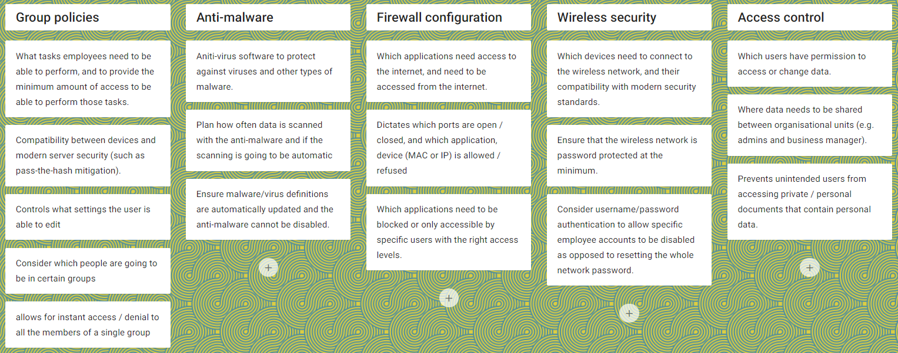

  

# BTEC Computing Unit 7 CD Notetaking <!-- omit in toc -->

This is a directory listing of my notes. Pages are ordered by the date they were created.

## Contents <!-- omit in toc -->

- [Planning protection](#planning-protection)
  - [Produce a plan](#produce-a-plan)
  - [Plan contents](#plan-contents)
  - [Organisational requirements](#organisational-requirements)
  - [Legislative requirements](#legislative-requirements)
  - [Format](#format)
  - [Overview](#overview)
  - [Example: Betty's Bakery](#example-bettys-bakery)
- [Testing](#testing)
  - [Testing effectiveness](#testing-effectiveness)
  - [Testing plan](#testing-plan)
  - [Proving effectiveness](#proving-effectiveness)
  - [Example test plan](#example-test-plan)

## Planning protection

### Produce a plan

- You should know which techniques you've researched can actually be implemented in the BTEC Lab
  - E.g., we couldn't set up biometric authentication/training in the BTEC Lab
- We need to make a plan for protecting an organisation's IT systems
- We will then use this plan to secure a system, review our plan, and enhance & evaluate it afterwards

### Plan contents

- produce a detailed and realistic plan that clearly shows what you intend to do to protect the IT system from a range of security threats
- give clear and reasoned justification of choices you've made during planning (why you intend to do this)
- include technical reasoning for why you have selected particular methods and configuration, as well as why you have rejected others

### Organisational requirements

**This information will be in the assignment brief.**

The brief will contain:

- the scenario
  - about the organisation and their setup
- the task
  - what you're expected to do

Your plan **must show that you have read, understood, and taken this into account**.

### Legislative requirements

Same laws as 7AB, especially the Data Protection Act.

Your plan **must show that you have read, understood, and taken this into account** (e.g. in an intro or justification).

### Format

- Structured
  - Bullet points, headings, etc
- May have intro
- Show what protection gets set up
- Justify the protections
- Justify things you left out

### Overview

- protect the IT system
- meet organisational and legislative requirements

The Unit explicitly states you must implement:

- group policies
- anti-virus/anti-malware
- firewall
- wireless security
- access control

Other measures can be implemented, too!

### Example: Betty's Bakery

We need to:

- set up appropriate user groups to demonstrate how to control access to each other's files
- connect to WiFi to demonstrate how to set up security for this type of network
- connect to the internet to demonstrate how to set up a Firewall to protect and restrict access to the system
- have anti-virus software installed and configured

## Testing

You need to...

- Review the extent to which the organisation's IT system has been protected
- Enhance the extent to which the organisation's IT system has been protected
- Test the extent to which the organisation's IT system has been protected

### Testing effectiveness

- How well protected is the system?
  - Does it work?
- Is the system still usable?
  - Users can still perform the tasks they need to perform
  - Using the software and files they need to use
- Does the system still perform well enough?
  - Can the protection affect productivity and slow down the system?

System administrators (SysAdmins) need to be proactive as the threats change all the time.

- Keep up to date with what current threats are
- Regularly check if current protection is adequate
- Look for ways to improve the protection

Setting up protection is **not a one-time affair**.

### Testing plan

- Set up the required protection
- Test that the protection works as expected
- Retest regularly
  - Ensure nothing else has affected another protection

Make a plan

- Risk protected against
- Test description
- Expected outcome
- Actual outcome
- Comments (any improvements, etc)

### Proving effectiveness

You should prove the effectiveness of your implementations using activity logs.

- Firewall block/allows logging
- Event logs
- File access logs
- Anti-malware scan reports

Logging uses resources. Do not log everything, otherwise you'll have a big issue with performance!

### Example test plan

| Test number | Threat targetted  | Test description      | Expected outcome | Actual outcome  | Comments |
| :---------: | ----------------- | --------------------- | ---------------- | --------------- | -------- |
|      1      | Firewall breaches | Set up port 80 access | Port 80 is open  | Port 80 is open |          |
